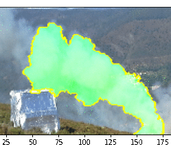

# yolime
YOLIME - Visual explanations for a Darknet YOLOv4 model using LIME

Explanations in the context of safety-critical fire detection application. Will add info when possible.

See the [notebook](https://github.com/AntMorais/yolime/blob/master/explainImageNotebook.ipynb) for an example execution and my [blog post](https://antmorais.github.io/YOLIME/) for additional information.

